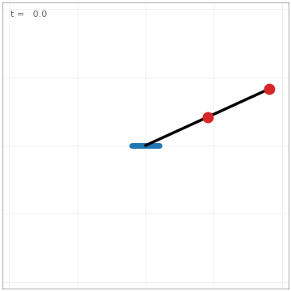

# Pendulum benchmark

The same double-pendulum integration written in C, C++, Fortran, Julia, MATLAB and
Python, as a way of comparing both **speed** and **beauty** on a problem that resists
the usual tricks.

<p align="center">
  
</p>

Every implementation solves an identical problem with identical arithmetic, and
`make validate` proves it: all sixteen agree to fifteen digits. The interesting result
is not that the compiled languages are fast — it is *which* of them are, by how little,
and what the beautiful versions cost.

## The problem

A double pendulum: two rigid links of length 1 carrying a unit mass at each joint, in
unit gravity. The configuration is given by the two angles $\theta_1,\theta_2$ measured
from straight down, and the equations of motion are

$$\theta_1'' = \frac{-3\sin\theta_1 - \sin(\theta_1-2\theta_2)
- 2\sin(\theta_1-\theta_2)\left(\theta_2'^2 + \theta_1'^2\cos(\theta_1-\theta_2)\right)}
{3-\cos(2\theta_1-2\theta_2)},$$

$$\theta_2'' = \frac{2\sin(\theta_1-\theta_2)\left(2\theta_1'^2 + 2\cos\theta_1
+ \theta_2'^2\cos(\theta_1-\theta_2)\right)}{3-\cos(2\theta_1-2\theta_2)}.$$

Introducing the angular velocities $\omega_1=\theta_1'$, $\omega_2=\theta_2'$ turns this
into a first-order system $\dot{\boldsymbol y} = \boldsymbol f(\boldsymbol y)$ for the
four-component state $\boldsymbol y = (\theta_1,\theta_2,\omega_1,\omega_2)$. That
function is `fpend` in every file here; the animation above is the actual trajectory it
produces.

The benchmark integrates it with a **six-stage, fifth-order explicit Runge–Kutta
method** — the one with weights $(17,0,100,2,-50,75)/144$ — from
$\boldsymbol y_0 = (2,2,0,-1)$ with $h = 0.2$ to $T = 10000$. That is **50 000
sequential steps**, six right-hand-side evaluations each, on a **four-element state**.

Every step depends on the previous one, so there is nothing to vectorize, nothing to
parallelize, and nothing to batch. That is the point: it is the shape of a great deal of
real scientific computing, and it is exactly the shape that array-oriented languages are
worst at. The system is also chaotic, which turns out to be useful — see
[Validation](#validation).

## Layout

```
c/pendulum.c                 explicit loops and an indexing macro
cpp/pendulum.cpp             std::vector<State>, needs only C++20
cpp/pendulum_mdspan.cpp      std::mdspan, columns copied in and out
cpp/pendulum_colref.cpp      std::mdspan, columns as assignable references
cpp/static_vector.hpp        the owning fixed-size vector C++ does not ship
cpp/static_vector_ref.hpp    its non-owning companion
fortran/pendulum.f90         external subroutines, the classic style
fortran/pendulum_modern.f90  module, associate, abstract interface, pure
julia/pendulum.jl            the straightforward version; allocates per call
julia/pendulum_inline.jl     + StaticArrays, @view and @inline  <- fastest overall
julia/pendulum_svector.jl    the same without @inline, to show what it costs
julia/pendulum_views.jl      preallocated buffers and broadcast; fast but ugly
julia/pendulum_cstyle.jl     Julia written as if it were C
julia/pendulum_tuple.jl      tuples plus broadcast: a cautionary tale
matlab/pendulum.m            straightforward MATLAB
python/pendulum.py           straightforward NumPy
python/pendulum_tuple.py     a 4-tuple value type, no NumPy in the hot loop
python/pendulum_numba.py     pendulum.py plus @njit, a six-line diff
python/pendulum_jax.py       jit + lax.fori_loop, the functional rewrite
animate.py                   makes pendulum.gif from python/pendulum.py
scripts/bench.py             runs everything, reports timings
scripts/validate.py          proves they all compute the same trajectory
```

## Building and running

```sh
make                # configure and build every compiled target this machine supports
make bench          # run everything available and print a timing table
make bench-quick    # the same, skipping the implementations that take seconds
make validate       # check that every implementation agrees
make animate        # regenerate pendulum.gif
make help
```

Nothing is required. Missing compilers, missing Julia, missing MATLAB and missing Python
packages are all reported as skipped rather than treated as errors, so `make && make bench`
does something useful on a bare machine with only a C compiler.

`numba` and `jax` are optional: `scripts/bench.py` and `scripts/validate.py` look for
them in the current interpreter and then in `./.venv` and `~/.venv`, and skip those two
files if neither has them. Only NumPy and Matplotlib are needed for the rest.

**`<mdspan>` is the one fussy dependency.** As of today it needs clang with libc++, so
the Makefile prefers `clang++` when it is installed; without it, `cpp/pendulum.cpp` still
builds with any C++20 compiler and the two mdspan variants are skipped with a message.
Force a compiler with `make CXX=g++`.

The sources are ordinary single-file programs, so you never have to use the build system:

```sh
gcc -O3 -o pendulum c/pendulum.c -lm
clang++ -O3 -fno-math-errno -std=c++23 -stdlib=libc++ -Icpp -o pendulum cpp/pendulum_mdspan.cpp
gfortran -O3 -o pendulum fortran/pendulum_modern.f90
julia julia/pendulum_inline.jl
python3 python/pendulum.py
cd matlab && matlab -batch pendulum
```

Each program prints ten timings, one per line. `scripts/bench.py` scrapes those numbers
back out and reports the best and the mean of the last five, which is why the
implementations themselves need no common output format or timing harness — the code
stays as plain as it would be if you wrote it for yourself.

**To get numbers you can trust**, fix the clock and pin to one core:

```sh
sudo cpupower frequency-set -g performance
taskset -c 0 make bench
```

Absolute times move by ~30% with the CPU governor alone, and on a hybrid CPU an unpinned
run may land on an efficiency core and read 40% slow.

## Conclusions

**1. Vanilla Julia, MATLAB and Python are beautiful and expressive** — exactly the code
people want to write. And they are slow, because every one of the 300 000 right-hand-side
evaluations allocates. The ranking is Julia 52 ms, MATLAB 104 ms, Python 1456 ms: Julia is
2× better than MATLAB, MATLAB is 14× better than Python, and Python is **193× off the best
implementation here**. Python is in a class of its own, and MATLAB is closer to vanilla
Julia than its reputation suggests.

**2. Julia can be brought *past* C speed without giving up the look of the code.** Views,
`StaticArrays` and `@inline` are enough; `julia/pendulum_inline.jl` differs from the
beautiful `julia/pendulum.jl` by four marks — `using StaticArrays`, `@view` on the column
read, `SVector` in the return, and `@inline` on `fpend` — and it is the **fastest
implementation here**, 3% ahead of the best C++, 5% ahead of C, 7% ahead of the original
Fortran, and 20% ahead of the ugly hand-buffered Julia. A 7× speedup over the vanilla
version for four annotations, with the integrator loop character-for-character unchanged.
MATLAB and Python have no equivalent. This is the strongest result in the set.

**3. Python can be rescued from outside the language, at a cost.** numba is remarkably
clean — `diff python/pendulum.py python/pendulum_numba.py` is six lines, mostly `@njit` —
and gets to 2.2× of the best. JAX reaches 3.7×, but only after the entire time loop is
rewritten as a functional `fori_loop` with no mutation. Both close a 193× gap to within a
small factor, which is the real point; neither is as clean or as fast as Julia's native
tools, and both are a separate compiler you have to keep happy.

**4. C is fast and ugly.** Explicit index loops everywhere, macros for 2-D indexing. It
buys nothing over the alternatives any more.

**5. Fortran gets real benefit from native multidimensional arrays and array arithmetic** —
whole-array expressions with no library, no template machinery, and column slices as
first-class values, and it sits at the front of the pack with nothing but `-O3`. Modern
Fortran (module with explicit interfaces, `associate`, an `abstract interface` for the
right-hand side, `pure` throughout) removes almost all of the verbosity of the old style
at no cost in speed. The one concession to performance is that the right-hand side writes
into an out-argument instead of returning an array — `call f(yn + h*k1/5, k2)` rather than
`k2 = f(yn + h*k1/5)` — which is worth 6–8%. Slightly worse syntax, and it puts modern
Fortran within 1% of the best C++ and ahead of C, with no library, no templates and no
hand-written vector class.

**6. Modern C++ recovers both beauty and speed, but has to build its own vocabulary
first.** The language still has no owning multidimensional array (`std::mdarray` is C++26)
and no arithmetic on `std::array`. `cpp/static_vector.hpp` and `cpp/static_vector_ref.hpp`
are the missing pieces, about 200 lines, after which the integrator reads like the Julia
version and runs slightly *faster* than C — second only to Julia. Eigen would do the same.
Every other language here has this out of the box; it is C++'s one real handicap, and it
is worth being blunt about.

**7. The headline result nobody expects: this benchmark is ~two thirds a `libm`
benchmark.** With the arithmetic equalized across languages, Julia, C, C++ and Fortran
land within 6% of each other — because they all spend ~5.2 ms of their ~7.8 ms inside the
same `glibc` `sin`/`cos`. They converge because the language is not what is being
measured. That reframes the whole exercise, and it is the most interesting thing to say
about it.

## Timings

Median of 8 interleaved rounds, each round taking the best of 10 in-run iterations, pinned
to one core with the CPU governor set to `performance` (core 0 holds 4.34–4.45 GHz under
load, against a 4.5 GHz max turbo, on AC power). Interleaving and a fixed clock matter:
under `powersave` the absolute times drift ~30% between rounds and the ordering of the
leading group shuffles. Distributions here are tight — ±0.3 ms — so the ranking is real,
and `pendulum_inline.jl`'s *slowest* round still beats every other implementation's
median. The one exception is `c/pendulum.c` against `fortran/pendulum.f90`: those two are
within 1% and swap places between runs. The ordering is not machine-state specific —
repeating it with every editor and browser closed moved everything down a uniform ~5.5%
and changed nothing else.

| Implementation | ms | vs fastest | Notes |
|---|---|---|---|
| **`julia/pendulum_inline.jl`** | **7.5** | **1.00×** | **beautiful *and* fastest — SVector + `@view` + `@inline`** |
| `cpp/pendulum.cpp` | 7.7 | 1.03× | `std::vector<State>`, no mdspan needed |
| `cpp/pendulum_colref.cpp` | 7.8 | 1.03× | mdspan + `static_vector_ref` column references |
| `cpp/pendulum_mdspan.cpp` | 7.8 | 1.03× | mdspan + `static_vector` |
| `fortran/pendulum_modern.f90` | 7.8 | 1.04× | modern Fortran, `pure subroutine` right-hand side |
| `c/pendulum.c` | 7.9 | 1.05× | |
| `fortran/pendulum.f90` | 8.0 | 1.06× | the classic style |
| `julia/pendulum_cstyle.jl` | 8.7 | 1.15× | Julia written as C |
| `julia/pendulum_views.jl` | 9.1 | 1.20× | fast-but-ugly Julia: preallocated buffers, `@.` everywhere |
| `julia/pendulum_svector.jl` | 10.7 | 1.42× | `pendulum_inline.jl` without `@inline` |
| `python/pendulum_numba.py` | 16.5 | 2.2× | `pendulum.py` + `@njit`, six-line diff |
| `python/pendulum_jax.py` | 27.8 | 3.7× | jit + `fori_loop`, held to one thread like the others |
| `julia/pendulum.jl` | 52.0 | 6.9× | the beautiful Julia baseline: allocates per call |
| `matlab/pendulum.m` | 103.8 | 13.8× | the beautiful MATLAB baseline |
| `python/pendulum_tuple.py` | 752 | 100× | plain Python 4-tuples, no NumPy in the hot loop |
| `python/pendulum.py` | 1456 | 193× | the beautiful Python baseline |
| `julia/pendulum_tuple.jl` | 1584 | 210× | cautionary tale: tuples + broadcast defeats Julia |
| JAX without `jit` | ~217 000 | ~29 000× | 4.3 ms *per step*; ~150× slower than plain NumPy |

Two orderings are worth pausing on. **Julia is first, ahead of C, C++ and Fortran** — not
merely level with them. And **the beautiful Julia beats the ugly Julia by 20%**
(`pendulum_inline.jl` 7.5 ms against `pendulum_views.jl` 9.1 ms), which reverses the usual
assumption that the buffer-juggling version must be faster. Under `powersave` the two
looked tied, which is exactly why the clock had to be fixed before drawing conclusions.

## Where the time actually goes

Measured by recording the real `sin`/`cos` arguments from a live trajectory and timing
only the `libm` calls on them:

| | libm time | total | libm share |
|---|---|---|---|
| original formulation (6 trig per RHS → 4 `libm` calls) | 9.3 ms | ~11.9 ms | ~78% |
| trig identities (4 trig per RHS → 2 `sincos` calls) | 5.2 ms | 7.8 ms | ~67% |

Reducing the library work made everything ~1.5× faster; two thirds of what is left is
still inside `glibc`. The arithmetic, the loop and all the memory traffic together are
~2.6 ms of the 7.8.

**No AVX is involved.** Default `-O3` targets baseline x86-64, i.e. SSE2: 128-bit packed
doubles (two at a time), no FMA, no `ymm`. The 4-element state arithmetic *is* vectorized,
just two-wide. And `-march=native`, which really does emit AVX2 + FMA, makes everything
**slower**: C 7.2 → 11.1 ms, C++ 7.3 → 11.7 ms, Fortran 7.4 → 10.9 ms. Wider vectors buy
nothing on 4-element states, and keeping `ymm` state dirty across 1.2 M `libm` calls costs
more than the arithmetic saves. So the codes are essentially optimal, and there is no
compiler-flag magic left.

## Findings worth mentioning

**The one big speedup left is mathematical, not linguistic.** Two `sincos` calls plus
trigonometric identities give every value the equations need —
$\sin(\theta_1-\theta_2) = s_1c_2 - c_1s_2$, $\cos(\theta_1-\theta_2) = c_1c_2 + s_1s_2$,
$\sin(\theta_1-2\theta_2) = s_\Delta c_2 - c_\Delta s_2$, and
$3-\cos(2\theta_1-2\theta_2) = 2 + 2s_\Delta^2$ — halving the library calls for a uniform
**1.5–1.6× in every language**. Exact algebra, no `-ffast-math`, no threads. Applied
everywhere in these files.

**Two fairness bugs were hiding in the original numbers.** The Fortran was factoring `h`
into the stage arguments (`yn + h*9*k1/4`), which lets the compiler hoist `h*9/4` out of
the loop, while C, C++ and Julia scaled `k` by `h` immediately. That was worth 6–7% and
was the entire reason Fortran once looked like the winner; the same trick applied to C++
dropped it from 18.0 to 16.7 ms. All files now use one convention. Separately, the Fortran
had `real(dp), parameter :: h = 0.2`, which takes the **single-precision** literal and
integrates with h = 0.200000002980232 — a different problem from every other file. Both
files now write `0.2_dp`. It is a classic Fortran gotcha and a good argument for
`make validate`.

**Is Julia's win an artifact of `@inline`? No — inlining is available to all of them, and
three of the four gain nothing from it.** None of the compiled versions inline `fpend` by
default: C makes six direct calls, C++ six indirect ones (the right-hand side arrives as a
function reference through the template parameter), and Fortran six indirect ones through
`procedure(rhs) :: f`. Given the same treatment: passing a lambda instead of a function
reference makes clang inline it, for no measurable change (7.32 → 7.32 ms); `-flto` makes
gfortran inline it, for no change (7.30 → 7.37); and gcc *refuses* to inline it even when
`fpend` is `static` and the inline budget is raised to 3000 instructions — forcing it with
`always_inline` makes C **8% slower** (7.39 → 7.99), so gcc's heuristic was right.

The reason `@inline` is worth 1.5× in Julia and ~0% elsewhere is that Julia was paying a
penalty the others never pay: un-inlined, `fpend` returns its `SVector` by value through
the ABI — a memory round-trip six times per step — and that also blocks the `@view` from
being optimized away. C, C++ and Fortran hand the result back through a pointer or
out-argument by convention, so their calls were already nearly free. `@inline` does not
give Julia a favour; it brings Julia up to the calling convention the others get for
nothing.

**Fortran's array-valued function results cost 8% here.** Writing the stages as
`k2 = f(yn + h*k1/5)` — a `pure function` returning `real(dp) :: f(neq)` — reads
beautifully and measures 7.8–8.0 ms, because gfortran does not elide the copy of the
result. The same file with a `pure subroutine` and an out-argument is 7.3–7.4 ms, so
`pendulum_modern.f90` uses that form; everything else about the modernization is
unaffected. Calling `fpend` directly instead of through the procedure argument recovers
almost nothing, so it is the result copy, not the indirect call.

**The obvious Fortran modernization is a 40% regression.** Declaring the trajectory as
`real(dp), intent(out), contiguous :: y(:,:)` and taking `nsteps` from `size(y,2)` costs
40%, because assumed shape hides the leading extent and the compiler stops knowing the
columns are length 4. `contiguous` does not help — it is the extent, not the stride. Hence
`nsteps` stays an explicit argument.

**NumPy is the problem, not the solution, at four elements.** `python/pendulum_tuple.py`
drops NumPy out of the inner loop in favour of a 4-tuple subclass with element-wise
operators, and is 1.9× faster than the NumPy version while looking better. Each NumPy
binary op costs ~0.5 µs of dispatch regardless of size. Related: transposing the result
array so states are contiguous changes `pendulum.py` by 0.4% — the layout was never the
problem. In numba, where the dispatch overhead is gone, the same change is worth 5%.

**numba is clean; JAX is a minefield.** numba's fastest form is nearly its naive form —
array-expression fusion means the obvious code beats hand-written scratch buffers, and
cleaning up the file made it 22% faster. JAX needed several traps disarmed: `h` hardcoded
as a literal instead of a traced argument makes XLA lose the in-place update of the loop
carry and turns the integrator **O(N²)** (15 → 50 → 262 µs per step at
N = 2 000 / 10 000 / 50 000 — this one line cost 84×, 2.08 s per run); materializing the
transpose on return costs 13 ms of 37 ms; and `scan(..., unroll=4)` is slower *and* changes
the numerical results. XLA's thread pool is a wash on a sequential loop, so the file pins
it to one thread.

**What JAX actually buys you.** Portability is real: the same source runs on a GPU with no
changes. Speed on a GPU is not — the loop is sequential over a 4-element state, so there is
nothing for thousands of cores to do, and float64 is throttled on most of them. What would
pay off is an *ensemble*: `jax.vmap` over many initial conditions is free to write and
embarrassingly parallel, though on the CPU it buys almost nothing here (463 → 438
ns/step/trajectory from batch 1 to batch 1024). Automatic differentiation is real and works
on the file as shipped, forward and reverse, agreeing to 14 digits — but on a chaotic system
the answer is useless: $|\partial\theta_1(T)/\partial\boldsymbol y_0|$ is 4.7 at T = 10,
5.8e17 at T = 100 and 3.7e133 over the full run, and reverse mode costs 87× the primal.
Julia has the same capability via ForwardDiff and Enzyme.

**Chaos makes a great validation tool, and a great slide.** Two correct implementations
agree to 15 digits at T = 10 and share no digits at all at T = 10000. JAX against numba, as
the run lengthens:

| T | steps | relative difference |
|---|---|---|
| 10 | 50 | 3.7e-15 |
| 20 | 100 | 6.1e-14 |
| 30 | 150 | 2.7e-13 |
| 50 | 250 | 1.7e-10 |
| 100 | 500 | 9.1e-02 |

A clean exponential with a Lyapunov time near 3, seeded by XLA's `sin`/`cos` differing from
glibc's by an ulp or two.

## Validation

```
$ make validate
Validating every implementation at T = 10 (50 steps).

  pendulum.c               -27.1127168681825
  pendulum.cpp             -27.1127168681825
  ...
  OK: all 16 implementations agree.
```

`scripts/validate.py` copies each file to a temporary directory, rewrites `T = 10000` to
`T = 10`, appends a checksum print, runs it, and compares everything against the median.
Fifty steps is long enough that a wrong Runge–Kutta coefficient or a mistyped step size
shows up in the first digit, and short enough that chaos has not yet amplified last-bit
differences between compilers — at the full `T = 10000` the checksums cannot be compared
at all. The largest deviation across all sixteen is 2.5e-15, which is summation order:
Julia's and MATLAB's `sum` are pairwise where C's loop is sequential.

Two stage typos turned up in the Julia files during exactly this cross-check —
`pendulum_views.jl` and `pendulum_cstyle.jl` both had `2k1/5` where the k3 stage needs
`2k2/5`, and `9k4/75` where k6 needs `8k4/75` — so they had been integrating a different
method all along, at the same speed. Both fixed.

## Environment

The numbers above: Intel Core Ultra 5 125H (AVX2 + FMA, no AVX-512), Linux, on AC power
with `cpupower frequency-set -g performance` (turbo enabled; core 0 sustains 4.34–4.45 GHz
of a 4.5 GHz maximum) and pinned with `taskset -c 0`. gcc 15.2.0, clang 21.1.8 with libc++,
gfortran 15.2.0, Julia 1.12.6, Python 3.14.4 (NumPy 2.3.5, numba 0.64.0), JAX 0.11.1,
MATLAB R2026a Update 4.

Set the governor before quoting any of these numbers. On `powersave` everything above 8 ms
still ranks correctly, but the leading group becomes a coin toss.

## Contributing

New languages and variants are welcome — see [CONTRIBUTING.md](CONTRIBUTING.md) for the
rules that keep the comparison fair (same arithmetic everywhere, no fast-math, no threads)
and for the output format `scripts/bench.py` expects. Results that contradict the tables
above are especially welcome; please say what hardware, compiler and CPU governor you used.

## Acknowledgements

The benchmark is mine: the problem comes from my Math 128A course at UC Berkeley, and the
original C, C++, Fortran, Julia, MATLAB and Python implementations, the choice of variants
to compare, and the conclusions this repository exists to illustrate are all my own work
from using these codes in talks over several years.

[Claude Code](https://claude.com/claude-code) was then used extensively on top of that, and
deserves credit for a good deal of what is here now:

- **Performance work.** The `sincos`-plus-identities rewrite of the right-hand side
  (~1.5× everywhere), equalizing where `h` multiplies across all implementations, and
  tracking down why `@inline` was worth 1.5× in Julia.
- **New variants.** `cpp/static_vector.hpp` and its companion, the `std::vector<State>` and
  column-reference C++ versions, the modern Fortran rewrite, `julia/pendulum_inline.jl`, and
  `python/pendulum_tuple.py`. The numba and JAX files were AI-written from the start and were
  rewritten here.
- **Debugging.** Two wrong Runge–Kutta stage coefficients that had been sitting in the Julia
  files, a single-precision `0.2` in the Fortran, and an accidentally quadratic JAX loop that
  was costing 84×.
- **Measurement and analysis.** Finding that two thirds of the runtime is `glibc` `sin`/`cos`,
  that `-march=native` makes everything slower, and that no compiler here inlines the
  right-hand side by default.
- **Build and tooling.** The CMake setup with its graceful skipping, `scripts/bench.py`,
  `scripts/validate.py`, `animate.py`, and this README.

Every number quoted above was measured rather than estimated, but I have not personally
re-derived all of them; corrections are welcome, and any mistakes that remain are mine.

## License

MIT, see [LICENSE](LICENSE). The problem and the reference MATLAB formulation come from
Math 128A at UC Berkeley.
